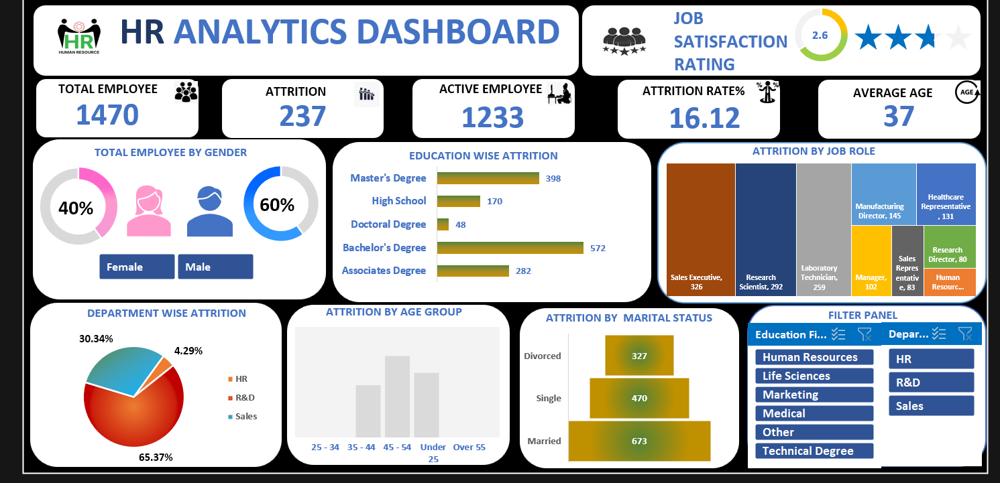

# HR Attrition Dashboard | Excel

## Dashboard Preview

---

# About the Project

This project focuses on analyzing employee attrition data using an interactive Excel dashboard. The dashboard helps identify the major factors affecting employee attrition, employee demographics, job satisfaction, and workforce trends.

The project was built using Microsoft Excel with Pivot Tables, Charts, Slicers, KPI Cards, and Data Analysis techniques to generate actionable HR insights.

---

# Project Objectives

The major objectives of this project are:

* Analyze employee attrition trends
* Identify departments with highest attrition
* Understand employee demographics
* Evaluate job satisfaction levels
* Analyze attrition by age group, gender, and education field
* Generate business insights for HR decision-making

---

# Dataset Information

The dataset contains HR employee records with information related to:

* Employee demographics
* Department details
* Attrition status
* Job satisfaction
* Education field
* Business travel
* Salary and experience metrics

### Dataset Details

* Total Rows: 1470+
* Total Columns: 44
* Tool Used: Microsoft Excel

---

# Tools & Features Used

## Microsoft Excel Features

* Pivot Tables
* Pivot Charts
* Slicers
* Conditional Formatting
* KPI Cards
* Data Cleaning
* Dashboard Design
* Excel Formulas

---

# Dashboard Components

The dashboard includes:

* Employee Attrition Analysis
* Department-wise Attrition
* Job Satisfaction Analysis
* Employee Distribution by Age Group
* Attrition by Education Field
* Attrition by Gender
* Interactive Filters & Slicers
* KPI Metrics

---

# Key Insights

* Identified departments with the highest employee attrition
* Analyzed employee attrition trends across different age groups
* Evaluated job satisfaction patterns among employees
* Found workforce distribution across departments and education fields
* Generated insights to help improve employee retention strategies

---

# Business Impact

This dashboard can help HR teams:

* Improve employee retention
* Identify high-risk attrition groups
* Optimize workforce planning
* Improve employee satisfaction
* Support data-driven HR decisions

---

# Project Workflow

Raw HR Dataset  
↓  
Data Cleaning & Preparation  
↓  
Pivot Table Analysis  
↓  
Charts & Visualizations  
↓  
Interactive Excel Dashboard  
↓  
Business Insights  

---

# Files Included

This repository contains 4 files:

1. HR ATTRITION DASHBOARD.xlsx → Excel Dashboard File  
2. HR Dataset.csv → Dataset File  
3. image Dashboard.png → Dashboard Screenshot  
4. README.md → Project Documentation  

---

# Skills Demonstrated

* Data Analysis
* Dashboard Development
* Data Visualization
* HR Analytics
* Excel Reporting
* Business Insights Generation

---

# Author

Bhupendra Sethiya  
Aspiring Data Analyst | SQL | PostgreSQL | Power BI | Excel | Python
